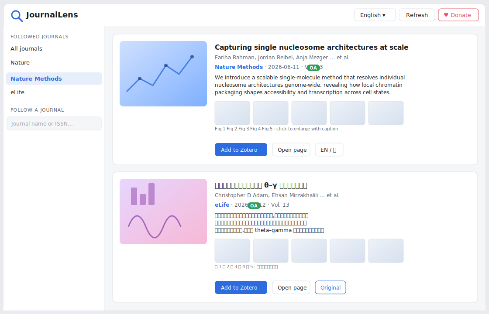

<div align="center">


# JournalLens

**Follow your favourite journals inside Zotero — browse papers from the past month with abstracts, real paper figures and captions, translate titles & abstracts between English and 中文, and add papers to your library in one click.**

在 Zotero 中关注你喜爱的期刊 — 浏览近一个月发表的论文摘要、正文图片与图注,中英文一键互译,并一键加入文献库。

[](https://www.zotero.org)
[](LICENSE)
[](https://github.com/Lyz-623/JournalLens/releases)
[](https://github.com/Lyz-623/JournalLens)

[English](#-overview) · [中文](#-简介) · [Features](#-features) · [Install](#-installation) · [Usage](#-usage) · [Changelog](#-changelog--版本记录) · [Donate](#️-support--打赏)

</div>

---

## 🔭 Overview

Keeping up with new papers means opening a dozen journal websites, squinting at title-only lists, and copy-pasting DOIs into Zotero. **JournalLens** brings that whole workflow *inside* Zotero:

- You pick the journals you care about.
- It pulls papers published in the **past 30 days** and shows each one as a rich card — not just a title, but the **abstract**, a **thumbnail from the paper itself**, and a strip of the **main figures with captions** so you can tell at a glance what the work is about.
- Don't read English comfortably? **Translate the title and abstract to 中文** (or back) with one click.
- Found something relevant? **Add it to your Zotero library** with full metadata in one click.

100% free, no account, no tracking.

<div align="center">

<br/><em>The JournalLens reading window — sidebar of followed journals, rich article cards, figure strip, and the EN ⇄ 中文 toggle (bottom card shown translated).</em>
</div>

## 🌟 简介

追新文献往往要打开十几个期刊网站,盯着只有标题的列表,再把 DOI 一个个复制进 Zotero。**JournalLens** 把整个流程搬进了 Zotero:

- 你选择关心的期刊;
- 它抓取这些期刊**近一个月发表的论文**,并把每篇论文做成信息丰富的卡片 —— 不只是标题,还有**摘要**、**来自论文本身的缩略图**,以及一排带图注的**正文主图**,让你一眼看出这篇做了什么;
- 英文读着累?**一键把标题和摘要翻成中文**(或翻回英文);
- 看到相关的?**一键连同完整元数据加入 Zotero 文献库**。

完全免费,无需账号,无任何跟踪。

---

## ✨ Features

<div align="center"></div>

| | Feature | Details |
|---|---|---|
| 📡 | **Follow journals** | Search by journal name or ISSN. Powered by Crossref — virtually every academic journal, any discipline. |
| 🗞️ | **Past-month feed** | Shows papers published in the **past 30 days** per journal (configurable). Merged across journals and sorted by date. |
| 🔬 | **Research only** | Hides news, editorials, comments, perspectives, corrections & errata. Keeps articles, reviews, letters, correspondence, protocols. |
| 📄 | **Full abstracts** | Expandable abstract on every card (Crossref + Europe PMC). |
| 🖼️ | **Smart thumbnails** | Prefers the paper's **graphical abstract / TOC** image, then full-text figures, publisher preview images, or OA landing-page images. |
| 📊 | **Main figures + captions** | A scrollable strip of figures from Europe PMC XML when available, with publisher-page image fallback; click any to view full-size with its caption. |
| 🌐 | **EN ⇄ 中文 translation** | Translate any title & abstract with one click; targets the current UI language when useful (Google, MyMemory fallback). |
| 🪟 | **Bilingual interface** | Switch the whole UI between English and 中文 anytime, from the top bar. |
| 🟢 | **Open-Access badges** | Instantly see which papers are freely readable. |
| ➕ | **One-click import** | Add any paper to Zotero by DOI, with full metadata. |
| 🔭 | **Quick open** | Toolbar button next to the search box, plus a Tools-menu entry. |
| ❤️ | **In-app donation** | PayPal / WeChat / Alipay QR codes built into the window. |
| 🌓 | **Light & dark mode** | Follows your system theme. |

### 功能一览(中文)

- **关注期刊** — 按期刊名或 ISSN 搜索(基于 Crossref,覆盖几乎所有学科)。
- **近一个月速览** — 默认显示各期刊**近 30 天**发表的论文(可调),跨期刊聚合并按日期排序。
- **只看研究内容** — 自动隐藏新闻稿、社论、评论、Perspective、更正等,保留 Article / Review / Letter / Correspondence / Protocol。
- **完整摘要** — 每张卡片可展开阅读摘要。
- **智能缩略图** — 优先使用论文的**图文摘要 / TOC** 图,再回退到正文图、出版商预览图或 OA 页面图片。
- **正文主图 + 图注** — 可横向滚动的主图条,优先来自 Europe PMC XML,并增加出版商页面图片兜底;点击任意图片放大查看图注。
- **中英互译** — 一键翻译标题与摘要,会优先翻译到当前界面语言(Google,自动回退 MyMemory)。
- **双语界面** — 顶栏随时切换中文 / English。
- **OA 标识、一键导入、工具栏快速打开、内置打赏、深色模式**。

---

## 📦 Installation

1. Download the latest `journallens-x.x.x.xpi` from the [**Releases**](https://github.com/Lyz-623/JournalLens/releases) page.
2. In Zotero, open **Tools → Plugins** (工具 → 插件).
3. Click the gear icon ⚙ → **Install Plugin From File…** and choose the downloaded `.xpi`.

> Requires **Zotero 7 or later** (tested on Zotero 9).
> In Firefox/Edge, right-click the download link and choose *Save Link As…* so the browser doesn't try to open the `.xpi` itself.
> 需要 **Zotero 7 及以上**(已在 Zotero 9 测试)。在浏览器中请右键"链接另存为"下载 `.xpi`。

---

## 🚀 Usage

1. **Open JournalLens** via the 🔭 **toolbar button** (next to the search box) or **Tools → JournalLens — Journal Feed**.
2. **Follow a journal**: in the left sidebar, type a journal name (e.g. *Nature Methods*) or an ISSN into *Follow a journal*, then click a result.
3. **Browse the feed**:
   - Click a **title** or **Open page** to open the article on the publisher's site.
   - Click **Show more** to read the full abstract.
   - Click a **figure** to view it full-size with its caption.
   - Click **EN / 中** to translate the title & abstract; click **Original** to switch back.
   - Click **Add to Zotero** to save the paper (with metadata) to your library.
4. **Switch language**: use the dropdown in the top bar to flip the whole interface between 中文 and English.
5. **Refresh** fetches the newest articles; results are cached for one hour by default.

### 使用方法(中文)

1. 通过 🔭 **工具栏按钮**(搜索框旁)或 **工具 → JournalLens — 期刊速览** 打开。
2. **关注期刊**:在左侧"添加期刊"框输入期刊名(如 *Nature Methods*)或 ISSN,点击搜索结果。
3. **浏览文章流**:点标题/打开原文跳转;点"展开"读全文摘要;点图片放大看图注;点 **EN / 中** 翻译,点"原文"切回;点"添加到 Zotero"保存。
4. **切换语言**:用顶栏下拉框切换整个界面的中文 / English。
5. **刷新**获取最新文章,默认缓存 1 小时。

---

## ⚙️ Settings

Open **Zotero Settings → JournalLens** (Zotero 设置 → JournalLens):

| Setting | Default | Description |
|---|---|---|
| Interface language / 界面语言 | Follow Zotero | UI language: auto / English / 中文 |
| Days to fetch / 抓取最近天数 | 30 | Publication-date window per journal |
| Max articles per journal / 每刊最多文章数 | 200 | Upper bound fetched before filtering |
| Cache duration / 缓存时长 | 60 min | How long feeds are cached |
| Translation service / 翻译服务 | Google | `Google` or `MyMemory` (use MyMemory if Google is blocked) |
| Only research content / 仅研究内容 | on | Filter out news/editorials/perspectives… |
| Load figures / 加载图片 | on | Fetch figures & captions for OA articles |

---

## 🔧 How it works

| Data | Source |
|------|--------|
| Recent articles per journal | [Crossref REST API](https://api.crossref.org) (all disciplines, filtered by publication date) |
| Abstracts, publication type & Open-Access status | [Europe PMC REST API](https://europepmc.org/RestfulWebService) |
| Graphical-abstract / figures & captions | Europe PMC open-access full text (JATS XML), publisher pages, DOI landing pages, Unpaywall OA landing pages |
| Title / abstract translation | Google translate (keyless) with a MyMemory fallback |

- **Figures & rich thumbnails** are best for **open-access articles indexed in Europe PMC** (most biomedical and many life-science journals). When XML figures are unavailable, JournalLens now falls back to publisher/DOI/OA landing pages and tries high-confidence preview or figure images.
- **Translation in China**: the default is Google; if it's unreachable, switch the translation service to **MyMemory** in settings.
- 正文图片与缩略图优先来自 Europe PMC 收录的**开放获取**文章;没有 XML 图片时会继续尝试出版商页面、DOI 页面和 Unpaywall OA 页面中的高置信图片。翻译默认 Google,若无法访问可在设置切换 **MyMemory**。

---

## 🛠 Build from source / 开发构建

```bash
git clone https://github.com/Lyz-623/JournalLens.git
cd JournalLens

# Build the .xpi  →  build/journallens-<version>.xpi
powershell -ExecutionPolicy Bypass -File build.ps1
```

**Run from source during development** (see the [Zotero plugin dev guide](https://www.zotero.org/support/dev/client_coding/plugin_development)):

1. Create a file named `journallens@yunze623.github.io` in your Zotero profile's `extensions/` directory whose contents are the absolute path to this project folder.
2. Remove the `extensions.lastAppBuildId` / `extensions.lastAppVersion` lines from `prefs.js` in the profile.
3. Start Zotero with `-purgecaches` to reload after code changes.

### Project layout

```
manifest.json          Plugin manifest (id, version, Zotero compatibility)
bootstrap.js           Lifecycle hooks; registers chrome, prefs pane, UI
prefs.js               Default preferences
content/
  journallens.js       Core service: feeds, filtering, translation, import
  feed.xhtml/.js/.css  The reading window
  preferences.xhtml    Settings pane
  donate/              PayPal / WeChat / Alipay QR images
locale/en-US, zh-CN    Fluent localisation for the settings pane
icons/                 Plugin & toolbar icons
docs/                  README assets
build.ps1              Packs the .xpi
publish.ps1            Creates the GitHub repo/release (needs `gh auth login`)
updates.json           Auto-update manifest
```

---

## 📜 Changelog / 版本记录

See [CHANGELOG.md](CHANGELOG.md) for the full history.

### v0.3.1 — 2026-06-13
Fixes UI language switching and per-card translation cache · adds Auto/Follow Zotero language mode in the feed window · expands figure extraction with publisher, DOI and Unpaywall landing-page fallbacks.

### v0.3.0 — 2026-06-13
Past-month feed by publication date · default per-journal fetch cap increased to 200 · payment QR images refreshed from local JPG files · README and visual docs updated.

### v0.2.0 — 2026-06-13
EN ⇄ 中文 translation · full bilingual UI · research-content filtering · latest-issues mode · graphical-abstract/TOC thumbnails · in-app donation panel · toolbar quick-open button.

### v0.1.0 — 2026-06-12
Initial release: follow journals, latest-article feed, abstracts, OA figures & captions, figure lightbox, one-click Zotero import, bilingual localisation, dark mode.

---

## ❤️ Support / 打赏

JournalLens is **free and open source**, and always will be. If it saves you time, a small tip is hugely appreciated and keeps the updates coming! You can also open this panel inside the plugin via **♥ Donate / 打赏支持**.

JournalLens **永久免费开源**。如果它帮你节省了时间,欢迎打赏支持 —— 你的支持是持续更新的最大动力!也可在插件窗口点击 **♥ 打赏支持** 打开此面板。

<div align="center">

| PayPal | 微信支付 WeChat Pay | 支付宝 Alipay |
|:---:|:---:|:---:|
|  |  |  |

</div>

Other ways to help / 其他支持方式: ⭐ **Star** the repo · 🐛 report bugs or ideas in [Issues](https://github.com/Lyz-623/JournalLens/issues) · 📢 share it with colleagues.

---

## 🤝 Contributing

Issues and pull requests are welcome! If you hit a journal that doesn't work well, please open an [issue](https://github.com/Lyz-623/JournalLens/issues) with the journal name / ISSN.

## 📄 License

[MIT](LICENSE) © yunze
