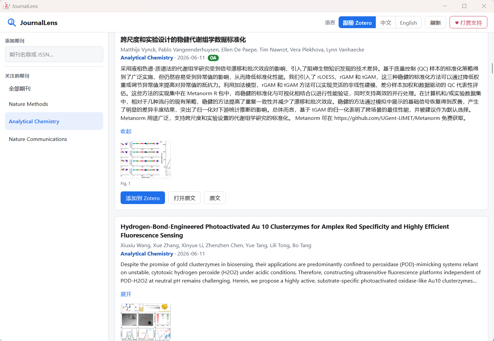
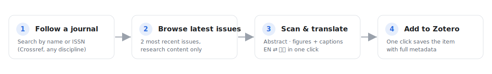

<div align="center">


# JournalLens

**A Zotero plugin for following journals, scanning recent papers, translating abstracts, viewing validated article figures, and saving papers to Zotero in one click.**

**JournalLens 是一个 Zotero 期刊追踪插件：在 Zotero 里关注期刊、浏览近期论文、翻译摘要、查看正文 Figure，并一键保存到文献库。**

[Latest release](https://github.com/Lyz-623/JournalLens/releases/latest) · [Changelog](CHANGELOG.md) · [Support](DONATE.md)

</div>

---

## Preview / 功能预览

真实运行截图：

<div align="center">

</div>

工作流程：

<div align="center">

</div>

## What It Does / 它解决什么问题

JournalLens is designed for researchers who already live in Zotero but still need to check journal websites, copy abstracts into translators, and manually import interesting papers. It brings that daily scanning workflow into one Zotero window.

JournalLens 面向每天需要追踪期刊更新的研究者：不用频繁打开不同期刊主页，也不用手动复制摘要翻译或再去导入 Zotero。插件把“找新论文、看摘要、看 Figure、保存文献”放在同一个 Zotero 窗口里。

## Highlights / 主要功能

| Feature | Details |
|---|---|
| Journal following / 关注期刊 | Search by journal name or ISSN through Crossref, then keep a followed-journal list in Zotero. |
| Recent-paper feed / 近期论文流 | Fetch papers from the last 7 days by default. The range can be changed and saved in settings from 1 to 180 days. |
| Abstract recovery / 摘要补全 | Uses Crossref, Europe PMC and publisher-page metadata fallbacks when abstracts are missing. |
| Body figures / 正文 Figure | Shows only validated `Fig. N` / `Extended Fig. N` images. Preview images, TOC graphics and blank thumbnails are filtered out. |
| Search in feed / 文章内搜索 | Search loaded titles and abstracts, with highlighted matches. |
| EN / 中文 | Switch UI language and translate titles or abstracts between English and Chinese. |
| One-click import / 一键导入 | Add a paper to Zotero by DOI with full metadata. |
| Zotero settings / 设置项 | Configure language, fetch window, cache, translation provider, research-content filtering and figure loading. |

## Install / 安装

1. Download `journallens-0.3.7.xpi` from [Releases](https://github.com/Lyz-623/JournalLens/releases/latest).
2. Open Zotero, then go to **Tools → Plugins**.
3. Click the gear icon and choose **Install Plugin From File…**.
4. Select the downloaded `.xpi`, then restart Zotero if prompted.

Requirements: Zotero 7 or later. If your browser opens the `.xpi` file directly, right-click the release asset and choose “Save link as…”.

## Usage / 使用方式

1. Open JournalLens from the Zotero toolbar button or **Tools → JournalLens**.
2. Add journals from the search box at the top-left.
3. Choose **All journals** or a specific journal in the sidebar.
4. Scan titles, authors, dates, abstracts and available figures.
5. Use the title/abstract search box to filter the currently loaded feed.
6. Click a figure to open the zoomable viewer, then switch images with previous/next controls.
7. Click **Add to Zotero** to save a paper.
8. Open **Zotero Settings → JournalLens** to change defaults.

## Figure Loading / 图片说明

JournalLens tries several sources for article figures:

- Europe PMC open-access full-text XML
- Crossref full-text links
- DOI and publisher article pages
- Unpaywall open-access article pages
- article-body or Extended Figure containers exposed in publisher HTML

Figures are displayed only when JournalLens can identify a real `Fig. N` or `Extended Fig. N` label and load a usable image. The plugin keeps the source figure numbering, prefers high-resolution image candidates, removes duplicates, and skips blank or low-quality thumbnail results.

图片抓取是尽力而为：开放获取文章和公开 HTML 页面效果最好；如果出版商屏蔽自动访问、图片由脚本动态加载，或正文只在付费 PDF 中，插件可能只能显示文字信息。

## Settings / 设置项

| Setting | Default |
|---|---:|
| Interface language / 界面语言 | Follow Zotero |
| Days to fetch / 抓取最近天数 | 7 |
| Max articles per journal / 每刊最多文章数 | 200 |
| Cache duration / 缓存时长 | 60 min |
| Translation service / 翻译服务 | Google |
| Research-content filter / 研究内容过滤 | On |
| Load figures / 加载图片 | On |

## Build / 开发构建

```powershell
git clone https://github.com/Lyz-623/JournalLens.git
cd JournalLens
powershell -ExecutionPolicy Bypass -File build.ps1
```

The packaged plugin will be created at `build/journallens-<version>.xpi`.

## Version Notes / 版本记录

- `0.3.7`: one-click bulk translation for all loaded article titles and abstracts, with progress and one-click return to originals.
- `0.3.6`: validated real `Fig. N` / `Extended Fig. N` labels, high-resolution figure candidates, blank/duplicate filtering, 7-day default fetch window with saved settings.
- `0.3.5`: publisher-page abstract fallback, Crossref works fallback, body/extended figures only, `Fig. N` label normalization.
- `0.3.4`: clears stale figure cache, stronger duplicate removal, caption width wrapping, centered previous/next figure controls.
- `0.3.3`: in-feed title/abstract search, highlighted matches, deduplicated figures, zoomable figure lightbox with previous/next navigation.
- `0.3.2`: UI polish, fixed language switching, fixed settings pane, lens + J toolbar icon, stronger figure parsing.
- `0.3.1`: fixed translation cache and added publisher/DOI/Unpaywall visual fallbacks.
- `0.3.0`: switched to past-month feeds and refreshed donation images.
- `0.2.0`: added bilingual UI, translation, content filtering, thumbnails and donation panel.
- `0.1.0`: initial journal feed, abstracts, OA figures and Zotero import.

See [CHANGELOG.md](CHANGELOG.md) for details.

## Support / 支持

JournalLens is free and open source. If it saves you time, a small tip or a GitHub star helps keep the updates coming.

JournalLens 免费开源。如果它帮你节省了时间，欢迎 Star 或打赏支持。

| PayPal | WeChat Pay / 微信支付 | Alipay / 支付宝 |
|:---:|:---:|:---:|
|  |  |  |

More details: [DONATE.md](DONATE.md)
