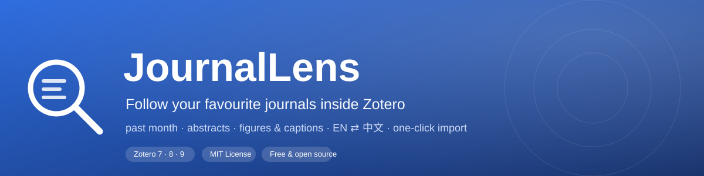
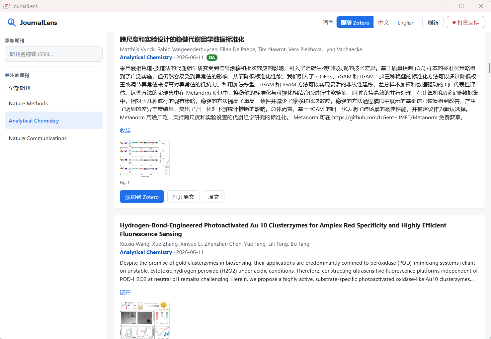
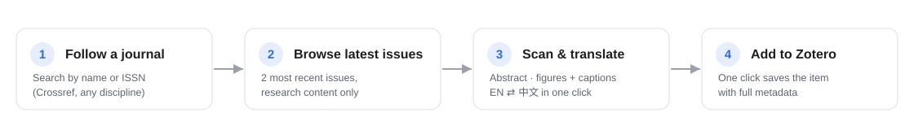

<div align="center">



# JournalLens

Follow journals in Zotero, scan recent papers, inspect validated article figures, translate paper information, and save papers by DOI.

在 Zotero 里关注期刊、浏览近期论文、查看经过校验的正文 Figure、翻译论文信息，并通过 DOI 一键保存到文献库。

[Latest release](https://github.com/Lyz-623/JournalLens/releases/latest) · [Changelog](CHANGELOG.md) · [Support](#support--buy-me-a-coffee)

</div>

## Preview / 预览

<div align="center">

</div>

<div align="center">

</div>

## Why / 为什么

JournalLens is for researchers who already live in Zotero but still jump between journal sites, abstracts, figures, translators, and manual imports. It brings that daily paper-scanning routine into one Zotero window.

JournalLens 面向每天需要跟踪期刊更新的研究者：不用反复打开期刊主页、复制摘要、查找正文图片或手动导入文献，常用流程都集中在 Zotero 里完成。

## Features / 功能

| Feature / 功能 | What it does / 说明 |
|---|---|
| Journal following / 关注期刊 | Search by journal name or ISSN through Crossref, then keep a followed-journal list in Zotero. 通过 Crossref 按期刊名或 ISSN 搜索，并在 Zotero 中保存关注列表。 |
| Recent-paper feed / 近期论文流 | Fetch papers from the last 7 days by default; the range can be saved from 1 to 180 days. 默认抓取近 7 天论文，可在 1 到 180 天之间调整。 |
| Daily cache / 每日缓存 | Reuse the same day's feed after restarting Zotero; Refresh always fetches again. 同一天重启 Zotero 会复用缓存，手动刷新会重新抓取。 |
| Abstract recovery / 摘要补全 | Recover missing abstracts from Crossref, Europe PMC, and publisher-page metadata. 当摘要缺失时，尝试从 Crossref、Europe PMC 和出版商页面补全。 |
| Validated figures / 正文 Figure | Show real `Fig. N` and `Extended Fig. N` images, filtering previews, TOC graphics, duplicates, and blank thumbnails. 只显示经过校验的正文图，过滤预览图、TOC 图、重复图和空白缩略图。 |
| Feed search / 文章内搜索 | Search loaded titles and abstracts with highlighted matches. 在已加载论文的标题和摘要中搜索并高亮匹配。 |
| Translation / 翻译 | Translate one article or all loaded titles and abstracts in one click. 支持单篇翻译，也支持一键翻译当前加载的所有标题和摘要。 |
| Zotero import / 导入 Zotero | Add a paper by DOI with full metadata. 通过 DOI 将论文及元数据保存到 Zotero。 |

## Install / 安装

1. Download `journallens-0.3.8.xpi` from [Releases](https://github.com/Lyz-623/JournalLens/releases/latest). / 从 Releases 下载 `journallens-0.3.8.xpi`。
2. In Zotero, open **Tools -> Plugins**. / 在 Zotero 中打开 **工具 -> 插件**。
3. Click the gear icon, choose **Install Plugin From File...**, and select the downloaded `.xpi`. / 点击齿轮图标，选择 **Install Plugin From File... / 从文件安装插件**，然后选择下载的 `.xpi`。
4. Restart Zotero if prompted. / 如有提示，重启 Zotero。

Requires Zotero 7 or later. If your browser opens the `.xpi` directly, right-click the release asset and choose **Save link as...**.

需要 Zotero 7 或更高版本。如果浏览器直接打开 `.xpi` 文件，请右键 Release 里的安装包并选择“另存为”。

## Usage / 使用

1. Open JournalLens from the Zotero toolbar button or **Tools -> JournalLens**. / 通过 Zotero 工具栏按钮或 **工具 -> JournalLens** 打开插件。
2. Add journals from the search box, then choose **All journals** or a specific journal in the sidebar. / 在搜索框中添加期刊，并在侧边栏选择 **All journals / 全部期刊** 或某本期刊。
3. Scan titles, authors, dates, abstracts, and available figures. / 浏览标题、作者、日期、摘要和可用 Figure。
4. Use feed search, translation, and the figure viewer when needed. / 按需使用文章内搜索、翻译和图片查看器。
5. Click **Add to Zotero** to save a paper, or open **Zotero Settings -> JournalLens** to change defaults. / 点击 **Add to Zotero / 添加到 Zotero** 保存论文，或进入 **Zotero Settings -> JournalLens** 修改默认设置。

## Figure Loading / Figure 加载

JournalLens tries Europe PMC full-text XML, Crossref full-text links, DOI and publisher pages, Unpaywall open-access pages, and article-body / Extended Figure containers in publisher HTML.

JournalLens 会尝试 Europe PMC 全文 XML、Crossref 全文链接、DOI 与出版商页面、Unpaywall 开放获取页面，以及出版商 HTML 中的正文 Figure / Extended Figure 容器。

Figures are displayed only when a real `Fig. N` or `Extended Fig. N` label and a usable image can be identified. This keeps source numbering, prefers higher-resolution images, removes duplicates, and skips blank or low-quality thumbnails. Figure loading is best-effort; blocked, script-only, or paywalled pages may only show text information.

只有识别到真实的 `Fig. N` 或 `Extended Fig. N` 标签，并且图片可正常加载时，插件才会展示该 Figure。插件会保留来源编号、优先使用高清候选图、去除重复结果，并跳过空白或低质量缩略图。Figure 抓取是尽力而为；如果页面被限制访问、依赖脚本动态加载，或图片只在付费 PDF 中，插件可能只能显示文字信息。

## Settings / 设置

| Setting / 设置 | Default / 默认值 |
|---|---:|
| Interface language / 界面语言 | Follow Zotero / 跟随 Zotero |
| Days to fetch / 抓取天数 | 7 |
| Max articles per journal / 每刊最多文章数 | 200 |
| Daily feed cache / 每日论文流缓存 | On / 开启 |
| Translation service / 翻译服务 | Google |
| Research-content filter / 研究内容过滤 | On / 开启 |
| Load figures / 加载 Figure | On / 开启 |

## Build / 构建

```powershell
git clone https://github.com/Lyz-623/JournalLens.git
cd JournalLens
powershell -ExecutionPolicy Bypass -File build.ps1
```

The packaged plugin is created at `build/journallens-<version>.xpi`.

构建完成后，插件包会生成在 `build/journallens-<version>.xpi`。

## Version / 版本

Current version: `0.3.8`, with persistent daily feed cache. Reopening Zotero reuses the same day's fetched papers, while Refresh forces a new fetch.

当前版本：`0.3.8`，新增持久化每日论文流缓存。同一天重新打开 Zotero 会复用已抓取论文，点击刷新会强制重新抓取。

See [CHANGELOG.md](CHANGELOG.md) for full release notes.

完整更新记录见 [CHANGELOG.md](CHANGELOG.md)。

## Support / Buy Me a Coffee

JournalLens is free and open source. If it saves you time, a GitHub star is already a kind boost; if you would like to support continued updates, you can buy me a coffee below.

JournalLens 是免费开源项目。如果它帮你节省了时间，点一个 Star 已经是很好的支持；如果你愿意支持后续维护，也可以请我喝杯咖啡。

| PayPal | WeChat Pay / 微信支付 | Alipay / 支付宝 |
|:---:|:---:|:---:|
|  |  |  |

More details: [DONATE.md](DONATE.md)

更多说明：[DONATE.md](DONATE.md)
